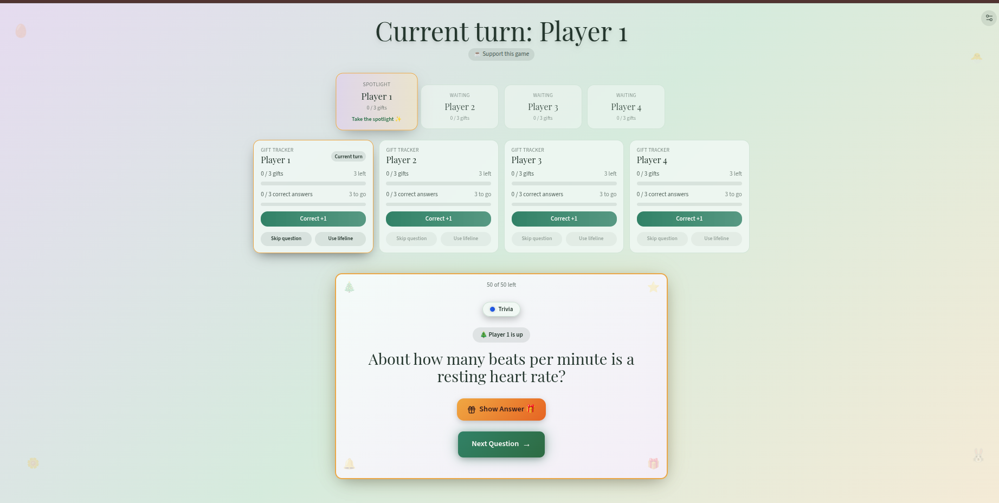
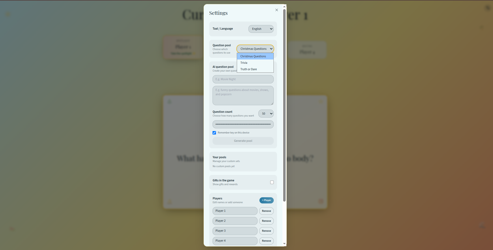
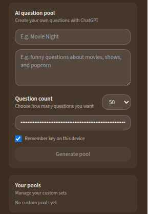
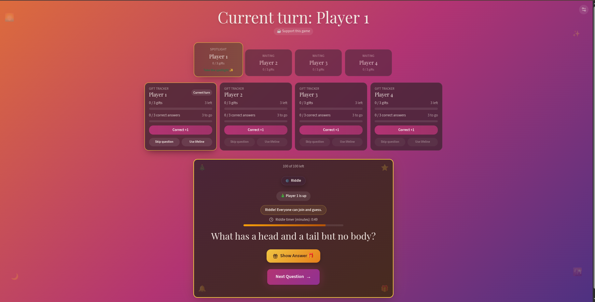
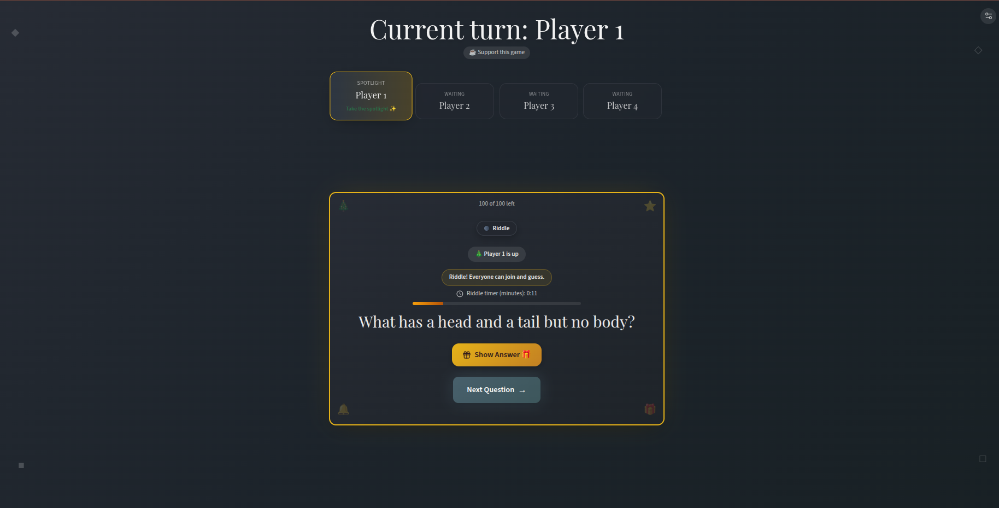

# Family Quiz Game 🎄

An interactive party game for any day. Rotate players, draw questions, use timers, and track gifts or play without them. Includes NL/EN, multiple themes, and custom AI question pools.

---

## Quick start

### Without Docker
1) Install Node 20+ and npm.  
2) Install deps: `npm ci`  
3) Run dev: `npm run dev` (opens on http://localhost:5173)  
4) Build/preview: `npm run build` then `npm run preview -- --host --port 4173`

### With Docker
1) Build: `docker compose build`  
2) Run: `docker compose up`  
3) Open http://localhost:4173  

*(If you prefer plain Docker: `docker build -t christmas-game .` then `docker run -p 4173:4173 christmas-game`.)*

---

## How to play
- **Players & turns**: Add/rename/remove players in *Settings*. Turns rotate automatically in a round-robin.
- **Question pools**: Pick from Christmas, Trivia, or Truth-or-Dare. Trivia and Truth-or-Dare support Kids/Adults variants.
- **All-play riddles**: When a riddle appears, everyone may guess. A configurable riddle timer counts down; requesting a hint subtracts 10 seconds. When time is up, a clear popup stops guessing.
- **Hints**: Riddles can reveal letters one by one; each hint costs time on the riddle timer.
- **Gifts (optional)**: Toggle gifts on/off. If enabled, track “good answers” per player and set the threshold (good answers per gift). Reaching the threshold awards a gift and triggers a lootbox prompt.
- **Bonuses**: “Vraag overslaan / Skip” and “Hulplijn / Lifeline” are once per player; only the active player can use them.
- **Themes**: Christmas Eve, Christmas Day, Easter, Summer, Cozy Night, Sunset, and Classic.
- **Fairness**: Turn order is fixed rotation; question deck reshuffles when empty.
- **AI pools**: Create custom question pools using your ChatGPT API key, a prompt, and a question count. Save or delete pools locally.

---

## Controls & UI
- **Settings panel**: Language (NL/EN), theme, question pool, kids/adults audience (when supported), AI pool builder, gifts toggle, max gifts, threshold, riddle timer, player management, shuffle deck.
- **Header**: Large “Current turn” banner.
- **Gift tracker**: Per player progress for gifts and good answers; buttons for good answer +1, skip, lifeline (hidden if gifts are off).
- **Lootbox**: On gift award, a reward card appears with a prompt to pick/hand over a present.

---

## Screenshots

Feature highlights:
- Themes: 
- Question pools: 
- AI question pools: 
- Gifts enabled: 
- Gifts disabled: 

---

## Tech stack
- Vite + React + TypeScript
- Tailwind + shadcn/ui
- React Query for data flows

---

## Support
If you enjoy the game, show your holiday spirit and consider buying me a coffee:

  
   
  <strong>Or scan the QR code:</strong>
   
  

