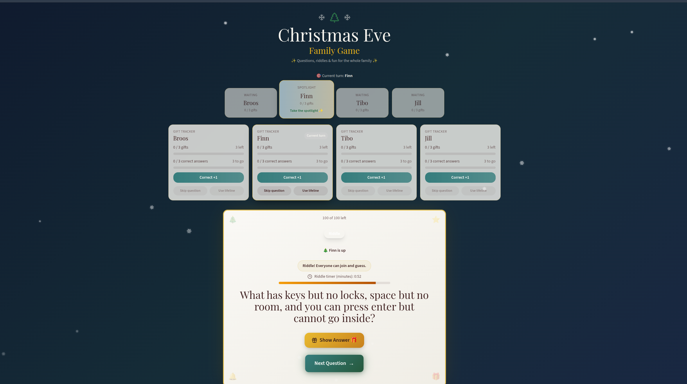
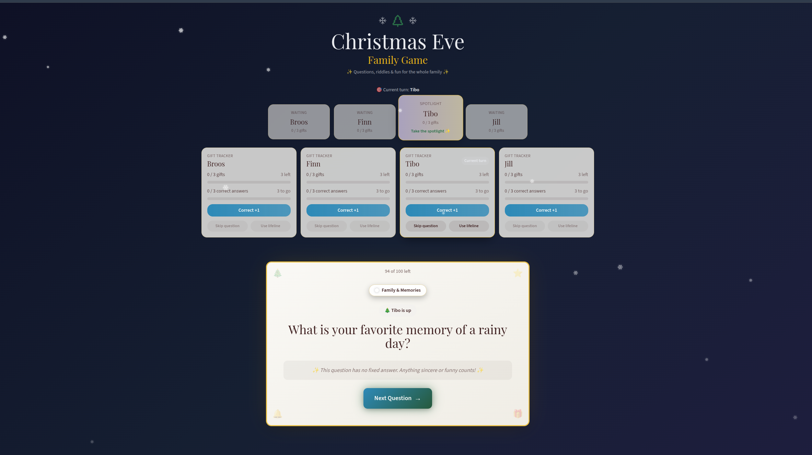
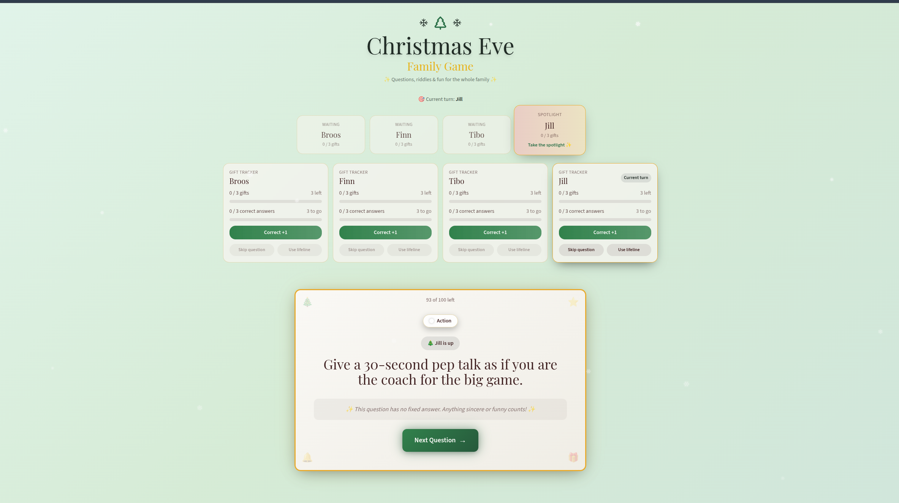
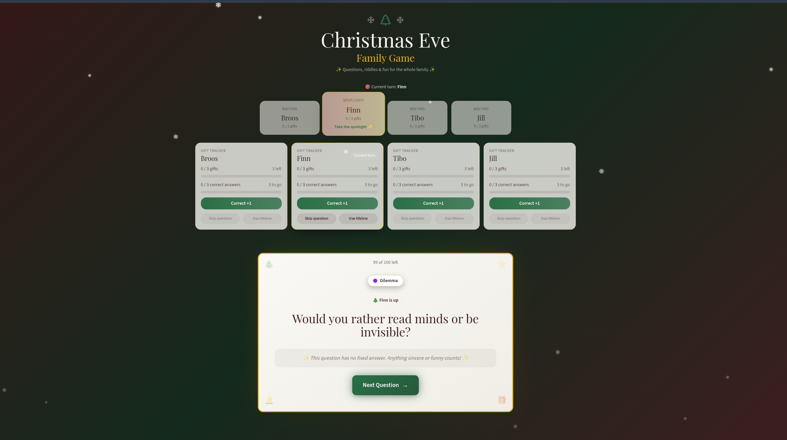
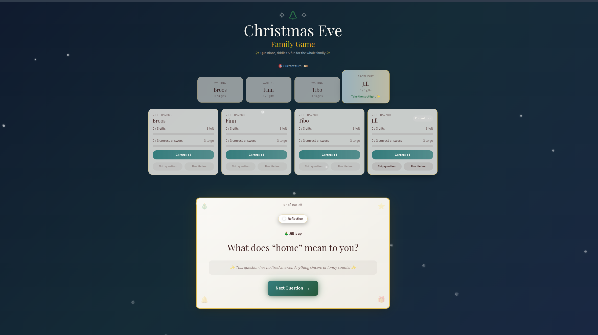

# Family Christmas Game 🎄

An interactive holiday party game with riddles, actions, dilemmas, reflections, player rotation, score tracking, lootbox rewards, multilingual NL/EN support, themes, and built-in fairness tools.

---

## Quick start

### Without Docker
1) Install Node 20+ and npm.  
2) Install deps: `npm ci`  
3) Run dev: `npm run dev` (opens on http://localhost:5173)  
4) Build/preview: `npm run build` then `npm run preview -- --host --port 4173`

### With Docker
1) Build: `docker compose build`  
2) Run: `docker compose up`  
3) Open http://localhost:4173  

*(If you prefer plain Docker: `docker build -t christmas-game .` then `docker run -p 4173:4173 christmas-game`.)*

---

## How to play
- **Players & turns**: Add/rename/remove players in *Settings*. Turns rotate automatically in a round-robin.
- **Questions**: 100 mixed prompts (Riddles, Family & Memories, Action, Dilemma, Reflection) with NL/EN text. Language is selectable in *Settings*.
- **All-play riddles**: When a riddle appears, everyone may guess. A configurable riddle timer counts down; requesting a hint subtracts 10 seconds. When time is up, a clear popup stops guessing.
- **Hints**: Riddles can reveal letters one by one; each hint costs time on the riddle timer.
- **Scoreboard → gifts**: Track “good answers” per player. Set the threshold (good answers per gift). When a player reaches the threshold, a gift is auto-awarded and a lootbox popup tells them to pick a present.
- **Bonussen**: “Vraag overslaan / Skip” and “Hulplijn / Lifeline” are once per player; only the active player can use them.
- **Themes**: Choose from Warm Red (default), Winternacht, Pepermunt Sneeuw / Peppermint Frost, and Middernacht Aurora / Midnight Aurora in *Settings*.
- **Fairness**: Turn order is fixed rotation; question deck reshuffles when empty.

---

## Controls & UI
- **Settings panel**: Language (NL/EN), theme, max gifts, threshold (good answers per gift), riddle timer minutes, player management, shuffle deck.
- **Spotlight**: Shows whose turn it is; riddles display an all-play notice and timer.
- **Gift tracker**: Per player progress bars for gifts and good answers; buttons for good answer +1, skip, lifeline.
- **Lootbox**: On gift award, a reward card appears with a prompt to pick/hand over a present.

---

## Screenshots

Category samples:
- Riddle: 
- Family & Memories: 
- Action: 
- Dilemma: 
- Reflection: 

---

## Tech stack
- Vite + React + TypeScript
- Tailwind + shadcn/ui
- React Query for data flows

---

## Support
If you enjoy the game, show your holiday spirit and consider buying me a coffee:

  
   
  <strong>Or scan the QR code:</strong>
   
  

